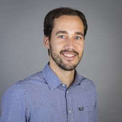

I'm a postdoctoral researcher interested in the semantics and pragmatics of natural language from theoretical, experimental, and computational perspectives. 

I currently work with <a href="https://sites.google.com/site/aemn1011/home" target="_blank">Andrea E. Martin</a>, <a href="http://www.markblokpoel.com/" target="_blank">Mark Blokpoel</a>, and <a href="https://irisvanrooijcogsci.com/" target="_blank">Iris van Rooij</a> in the <a href="https://www.languageininteraction.nl/" target="_blank">Language in Interaction</a> project at the Donders Institute of Brain, Cognition and Behaviour.
