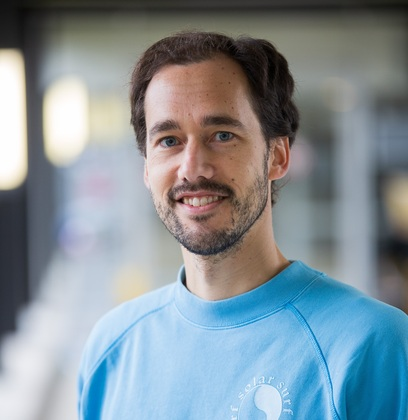

<figure style="float: left; margin-left: -5px; margin-top: -5px; margin-right: 25px; max-width: 30%; min-width: 100px; height: auto;"><figcaption style="font-size: small; color: grey;">Photo by Ted van Leeuwen</figcaption></figure>

I am assistant professor in philosophy at the Radboud University Nijmegen. I am interested in the semantics and pragmatics of natural language. 

I currently work with <a href="https://sites.google.com/site/aemn1011/home" target="_blank">Andrea E. Martin</a>, <a href="https://www.ru.nl/english/people/blokpoel-m/" target="_blank">Mark Blokpoel</a>, and <a href="https://irisvanrooijcogsci.com/" target="_blank">Iris van Rooij</a> in the <a href="https://www.languageininteraction.nl/" target="_blank">Language in Interaction</a> project at the Donders Institute of Brain, Cognition and Behaviour.

You can also find me on <a href="https://scholar.google.com/citations?user=IvsCy60AAAAJ&hl" target="_blank">Google Scholar</a>.
