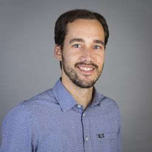

I'm a postdoctoral researcher interested in semantic and pragmatic issues, both from a theoretical and an experimental perspective. I currently work with [Andrea E. Martin](https://sites.google.com/site/aemn1011/home), [Mark Blokpoel](http://www.markblokpoel.com/), and [Iris van Rooij](https://irisvanrooijcogsci.com/) in the [Language in Interaction](https://www.languageininteraction.nl/) project at the Donders Institute of Brain, Cognition and Behaviour.

Previously, I worked as a postdoctoral researcher in the <a href="https://www.leibniz-zas.de/en/research/research-areas/semantics-pragmatics/muqtasp" target="_blank">MUQTASP</a> project at the Leibniz-Zentrum Allgemeine Sprachwissenschaft in Berlin, and in the <a href="https://acte.ulb.be/index.php/en/" target="_blank">Autism in Context</a> project at the Université Libre de Bruxelles.

Between 2010 and 2014, I was a Ph.D. student at the Philosophy department of the Radboud University Nijmegen, supervised by Rob van der Sandt and <a href="https://sites.google.com/site/brtgrts/" target="_blank">Bart Geurts</a>.
